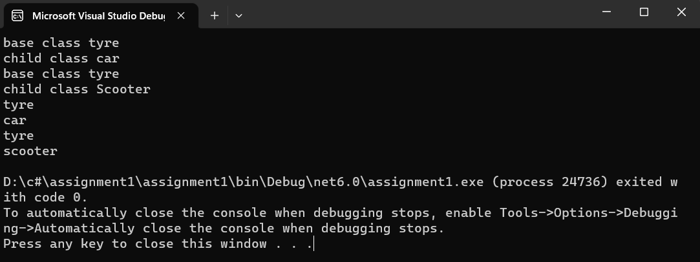

## Inheritance

## Aim:
To write a C# program to print some messages using hierarchical inheritance.
## Algorithm:
## step 1:
Create a base class.

## step 2:
Create two child class.

## step 3:
Create a constructor in the base class and print a message.

## step 4:
create a function in child class to print a message.
## Program:
```
using System;
namespace Vehicle
{
    public class tyre
    {
        public tyre()
        {
            Console.WriteLine("base class tyre");
        }
        public virtual void Display()
        {
            Console.WriteLine("tyre");
        }

    }
    public class scooter : tyre
    {
        public scooter()
        {
            Console.WriteLine("child class Scooter");
        }
        public override void Display()
        {
            base.Display();
            Console.WriteLine("scooter");
        }

    }
    public class car : tyre
    {
        public car()
        {
            Console.WriteLine("child class car");
        }
        public override void Display()
        {
            base.Display();
            Console.WriteLine("car");
        }
    }
    
    public class Program
    {
        static void Main(string[] args)
        {
            car cr = new car();
            scooter sc = new scooter();
            cr.Display();
            sc.Display();

        }
    }


}
```
## Output:


## Result:
Thus C# program to print some messages using hierarchical inheritance is written and executed sucessfully.
